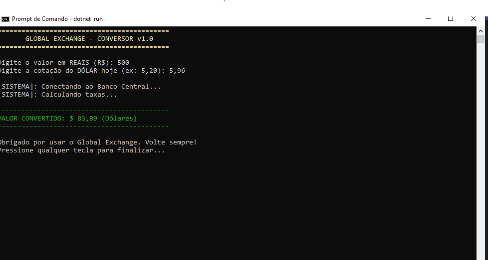

🛠️ O Algoritmo da Entrega
1. Preparar o Terreno (Repositório Final)
Crie o último repositório desta jornada no GitHub: una-ihcux-lista05

2. O Desafio do "Sistema Financeiro"
Siga os comandos:

Navegue até sua pasta de projetos (cd LabDotnet).
Crie o projeto: dotnet new console -n ConversorExpert.
Entre na pasta: cd ConversorExpert.
Abra no VS Code: code ..
3. O Código Mestre
Substitua o conteúdo do Program.cs por este sistema completo:

📸 Registro de Evidência
Tire um print do terminal mostrando uma conversão feita com sucesso. O print deve mostrar as mensagens de carregamento ("Conectando ao Banco Central...") e o resultado final formatado.

📂 Estrutura do Repositório
**A pasta ConversorExpert**: Código fonte completo.
evidencia-final.png: Print do sistema funcionando.
README.md: Um resumo de todas as heurísticas que você aplicou (Status, Prevenção de Erros e Estética).

Microsoft Windows [versão 10.0.19045.6456]
(c) Microsoft Corporation. Todos os direitos reservados.

C:\Users\4261213885>cd desktop

C:\Users\4261213885\Desktop>cd labdotnet

C:\Users\4261213885\Desktop\LabDotnet>cd conversorexpert

C:\Users\4261213885\Desktop\LabDotnet\ConversorExpert>code .

C:\Users\4261213885\Desktop\LabDotnet\ConversorExpert>dotnet run
